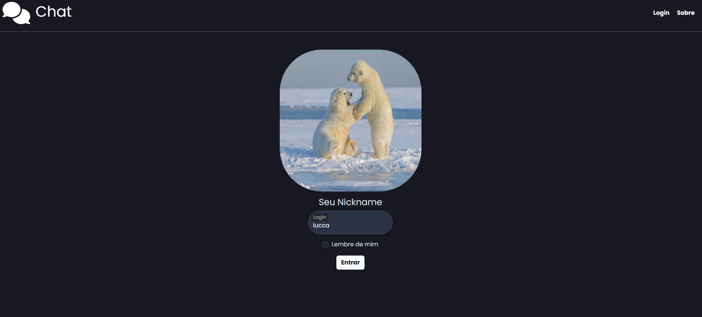
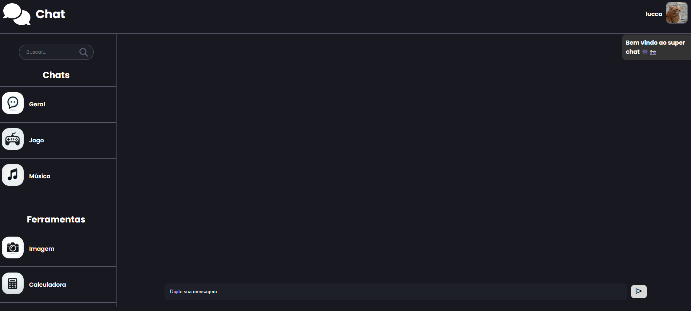
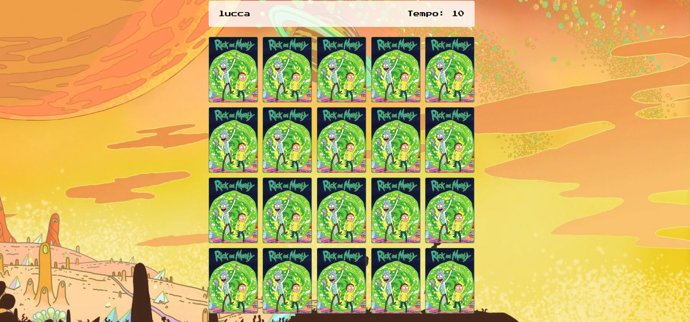
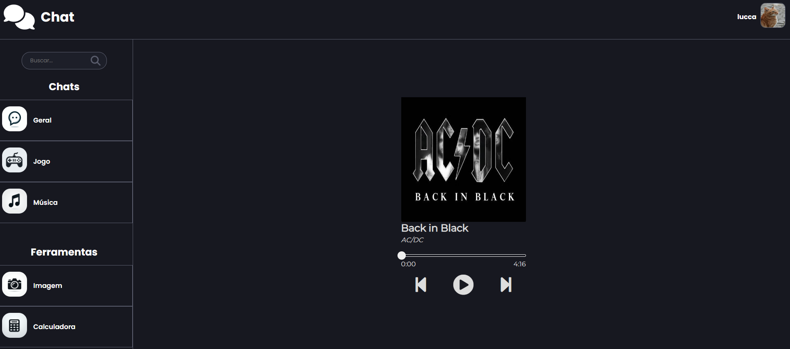
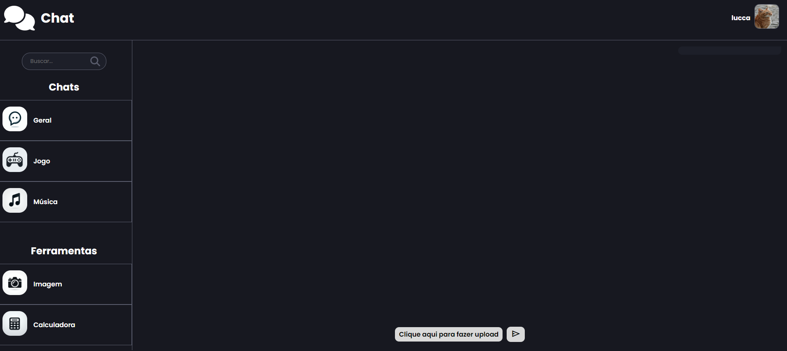
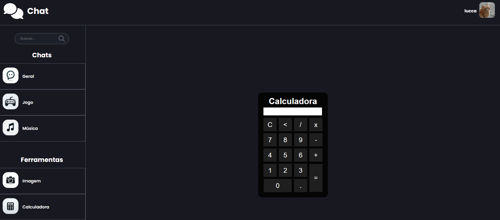

LINK SLIDE projeto paralelismo: https://www.canva.com/design/DAGEZo8KEo4/wQBQqieZjLHJbaTPehZlOA/edit?utm_content=DAGEZo8KEo4&utm_campaign=designshare&utm_medium=link2&utm_source=sharebutton

<h1 align="center">📝 CHAT-WSS 📝</h1>

 

Projeto desenvolvido em JavaScript e Node.js  

  <a href="#-descrição">Descrição</a>&nbsp;&nbsp;&nbsp;|&nbsp;&nbsp;&nbsp;
  <a href="#-tecnologias">Tecnologias</a>&nbsp;&nbsp;&nbsp;|&nbsp;&nbsp;&nbsp;
  <a href="#-projeto">Projeto</a>&nbsp;&nbsp;&nbsp;|&nbsp;&nbsp;&nbsp;
  &nbsp;&nbsp;&nbsp;|&nbsp;&nbsp;&nbsp;

  

 

# 📝 Descrição

Este projeto foi feito para uma atividade acadêmica. Ele conta com um chat geral, uma conexão websocket, um jogo da memória, um player de música, um processamento de imagem para escala de cinza, utilizando o servidor Node para servir a imagem processada para o usuário, e uma calculadora.
tambem contando com a API da unsplash para servi imagens random

## 🚀 Tecnologias

Esse projeto foi desenvolvido com as seguintes tecnologias:

- Javascript
- HTML & CSS
- Boostrap & materialize
- API unsplash
- Node.JS
- Websocket
- Git e Github

## 💻 Projeto
 

  

  <strong>Tela Login</strong>  

    
Esta é uma página HTML para um formulário de login com tema sombrio. Ele usa Bootstrap para layout e estilo. O formulário possui um único campo de entrada para nome de usuário (denominado "Login") e uma caixa de seleção "Lembre de mim".
 
 

 

##
 

  <strong>Tela de login</strong> 

    

 Aqui temos a tela de home onde voce encontra todas as funcionalidade de navegacao contando com o toast de bem vindo usando materialize
 

 

##

   <strong>Tela de inscrever-se</strong> 

    

  Esse é nosso jogo da memoria com o tema do rick and morty, fazemos o random das cartas e quando consegue acha todas aparace a notificacao do seu tempo no toast

 

 

##

  <strong>Tela com lista de tarefas</strong> 

  

Aqui temos nosso player de musica com alguns classicos incontestaveis 
  
 

 

##

  <strong>Tela com lista de tarefas</strong> 

  

 Aqui temos nosso processamento de imagem, onde com o noda usando o sharp fazemos a escala de cinza em qualquer imagem que o usuario enviar
   

 

##

  <strong>Tela confirmações de excluisão</strong> 

     

    e chegamos na nossa classica calculadora

 

  

## 🤝Colaboradores

- Colaboradores que fizeram parte do projeto.
  

     -  [@Lorrana Nasareth](https://github.com/LorranaNS)
      
     -  [@Luan Medrado](https://github.com/LuanMedrado8)
          
     -  [@Guilherme Braga](https://github.com/guiibrag4)
          
        
 

